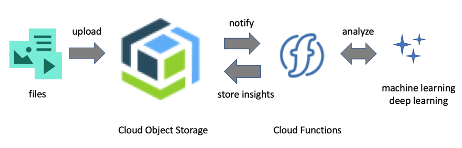
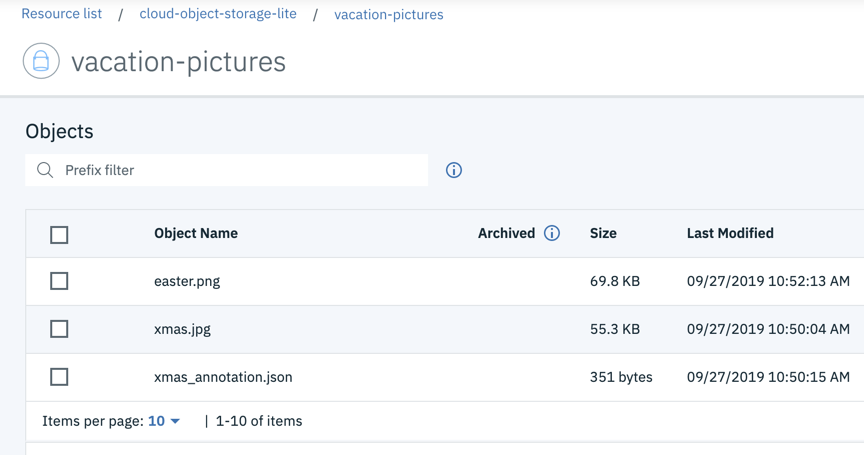
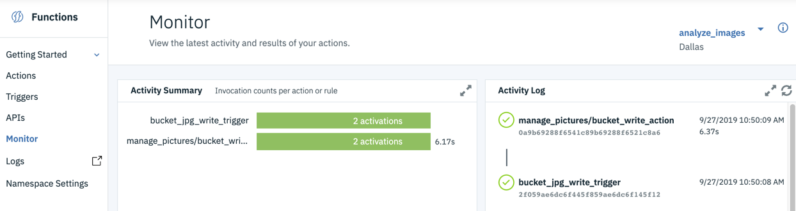

## Create a serverless app that annotates images (text, video, audio, ...) 

In this tutorial you will create a serverless application using [IBM Cloud Functions](https://cloud.ibm.com/functions/) that monitors the content of a Cloud Object Storage bucket for changes using [triggers](https://cloud.ibm.com/docs/openwhisk?topic=cloud-functions-pkg_obstorage#pkg_obstorage_ev). Whenever an image is uploaded to the bucket a Cloud Object Storage trigger fires and invokes an action that analyzes the image content using a deep learning microservice from the [Model Asset Exchange](https://developer.ibm.com/exchanges/models/).

Out of the box the application detects objects in an image but you can easily modify the application to generate image captions or perform other kinds of analysis on images or other media types, such as text, audio, or video. The Cloud Functions source code is included for Python and Node.js.

## Steps

If you are not familiar with IBM Cloud Functions or Cloud Object Storage, follow the detailed deployment instructions in this tutorial.

### Quickstart

If you are already familiar with IBM Cloud Functions and Cloud Object Storage you can use the shell and batch scripts in this repository to create and delete the serverless application. To use the scripts you must have a current version of the [IBM Cloud CLI installed](https://cloud.ibm.com/docs/cli/reference/ibmcloud?topic=cloud-cli-install-ibmcloud-cli) and the [Cloud Functions plug-in installed](https://cloud.ibm.com/docs/openwhisk?topic=cloud-functions-cli_install#cli_plugin_setup).

1. Create a [Cloud Object Storage](https://cloud.ibm.com/catalog/services/cloud-object-storage) service instance in the IBM Cloud.
1. Create service credentials for this service instance that the serverless app will use to access the bucket.
1. Create a regional bucket (in `us-south`, `us-east`, or `eu-gb`) in this instance.
1. Open a terminal window.
1. Customize `create_serverless_app.sh/bat` by replacing the `<TODO-...>` placeholders.
1. Run `create_serverless_app.sh/bat` to create the application.
1. Open the [Cloud Functions dashboard](https://cloud.ibm.com/functions/dashboard) in a web browser.
1. Upload a JPG/PNG image to the regional bucket and monitor the Cloud Functions activity log.
   
1. Upload a text file to the bucket. No action should be triggered.
1. Delete a previously uploaded JPG/PNG image. The corresponding JSON annotations file should be automatically removed.

To uninstall the application run `delete_serverless_app.sh/bat` .

## License

[Apache 2.0](LICENSE)